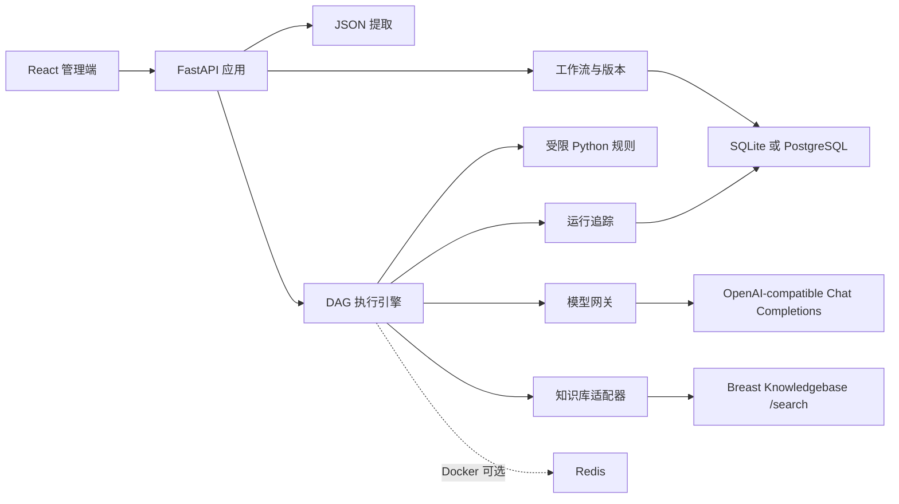

# 乳腺癌决策智能体平台 MVP 设计规格

日期：2026-08-17
版本：V1.0
状态：待用户审阅

## 1. 目标与范围

建设一个面向乳腺癌决策智能体项目的可运行 MVP。平台从院内传入的全量 JSON 中提取工作流所需字段，使用节点连线方式搭建包含确定性规则和大模型 Agent 的决策工作流，在线测试并比较原始数据、提取数据和最终输出，同时支持对提示词和规则进行可追溯优化。

本 MVP 包含：

- 工作流基本信息、草稿、发布版本和版本不可变性。
- 全量 JSON 字段选择、路径映射、提取预览和缺失字段校验。
- 输入、输出、条件、受限 Python 规则、LLM、并行 Agent 节点。
- OpenAI Chat Completions 兼容模型配置：`base_url`、API Key、模型、超时、重试和生成参数。
- 在线测试、节点级日志、模型调用记录、知识库证据引用和输出对比。
- 提示词优化候选、规则节点复制/粘贴和外部 LLM/Codex 协作。
- 优先对接 `D:\coding\knowledgebase`，同时提供通用知识库 HTTP 适配器。

本阶段不实现医院 SSO、多租户、正式审批链、生产级沙箱、高可用调度和完整基础设施加固，但数据模型保留扩展字段。

## 2. 参考方案与页面对应

设计以用户提供的实施方案说明书和五张参考图为交互基准：

1. 版本与基本信息页：配置工作流名称、说明、负责人、状态、版本备注和模型配置。
2. 全量 JSON 提取页：左侧显示原始 JSON 树，右侧配置字段路径、别名、类型、默认值并实时预览。
3. 工作流画布页：以 React Flow 展示 DAG，节点支持拖拽、连线、复制、删除、配置和运行日志查看。
4. 在线测试页：选择模型和工作流版本，输入测试 JSON，横向比较原始数据、提取结果、最终输出和执行日志。
5. 提示词优化页：抓取工作流输出，调用模型生成局部提示词候选，展示差异、测试结果和保存为新草稿的操作。

## 3. 架构方案

采用模块化单体架构，Docker 和非 Docker 共用业务代码。



### 3.1 前端

- React、TypeScript、Vite。
- React Flow 负责画布和节点连线。
- TanStack Query 或等价数据层负责 API 缓存、运行状态刷新和错误状态。
- 编辑器状态与后端工作流定义分离，保存前执行前端校验，后端再次校验。

### 3.2 后端模块

- `workflow`：工作流元数据、草稿、发布、克隆和版本哈希。
- `extraction`：JSON 路径解析、类型转换、默认值和提取预览。
- `execution`：DAG 校验、拓扑调度、分支、并行 Agent、取消和状态机。
- `nodes`：输入、输出、条件、Python 规则、LLM 和并行 Agent 执行器。
- `model_gateway`：统一 OpenAI Chat Completions 兼容请求、超时、重试、结构化输出和脱敏。
- `knowledge_gateway`：现有知识库适配器和通用 HTTP 适配器。
- `trace`：运行、节点、模型调用、知识库引用和错误日志。
- `optimization`：提示词候选生成、局部替换、测试比较和保存草稿。

### 3.3 部署

- Docker Compose：前端、FastAPI、PostgreSQL，Redis 作为可选任务队列。
- 非 Docker：启动脚本、SQLite、FastAPI 进程内执行，适合本地演示和轻量部署。
- 所有外部服务通过环境变量或本地配置注入；密钥不得写入工作流定义、日志、数据库或导出内容。

## 4. 工作流版本与数据模型

核心实体：

- `workflow`：名称、说明、负责人、标签、当前草稿 ID、创建和更新时间。
- `workflow_version`：版本号、状态（draft/published/archived）、节点图 JSON、提取配置、模型配置引用、创建人、发布时间和内容哈希。
- `workflow_node`：节点 ID、类型、名称、位置、配置和端口定义。实际保存于版本快照中，避免发布版本被后续编辑影响。
- `workflow_edge`：源节点、目标节点、端口或分支条件。
- `model_profile`：兼容接口地址、模型名、生成参数和密钥引用。密钥只从运行环境读取。
- `run`：工作流版本、模型配置、状态、输入哈希、开始/结束时间和错误摘要。
- `node_trace`：运行 ID、节点 ID、父节点追踪 ID、输入/输出摘要、耗时、重试次数、状态、错误和引用。
- `prompt_candidate`：原提示词、候选提示词、修改说明、测试结果和确认状态。

已发布版本不可修改。编辑发布版本时复制为新草稿；测试草稿时保存草稿内容哈希。运行日志必须能还原到工作流版本、节点配置和模型配置快照。

## 5. JSON 提取设计

提取页接收一份全量 JSON 样例，生成可浏览的树和路径选择器。每个提取项包含：

```json
{
  "alias": "住院文书",
  "path": "$.院内数据.住院文书",
  "type": "array",
  "required": false,
  "default": []
}
```

支持对象、数组、字符串、数字、布尔和空值；支持数组下标、字段别名、基础类型转换和缺失字段策略。提取配置保存于工作流版本中，并在运行开始时生成 `extracted_data`。提取失败时返回路径、期望类型、实际值类型和节点定位信息。

## 6. 节点规范

所有节点共享输入上下文：原始 JSON、提取数据、上游输出、知识库证据和运行元数据。每个节点必须声明输出 Schema。

### 6.1 输入节点

从提取上下文选择字段，支持重命名、默认值和输出 Schema。输入节点输出只读对象供后续节点引用。

### 6.2 条件节点

提供 `AND`、`OR`、`NOT`、等于、不等于、大于、小于、大于等于、小于等于、包含、集合匹配、存在和为空。条件树生成独立分支端口。条件不满足属于正常跳过，不记为错误。

### 6.3 Python 规则节点

Python 节点用于实现原 QL 引擎示例中的列表遍历、对象读取、空值处理、字符串/正则加工和多字段输出。输入配置为字段映射，输出配置为字段 Schema，代码配置为受限 Python。

为保证非开发人员易用，提供三种入口：

- 可视化规则：选择字段并组合遍历、筛选、判断、提取、替换、默认值和输出操作。
- AI 辅助：用中文描述目标，模型生成 `RuleSpec`、Python、输出 Schema 和测试样例。
- 高级代码：直接查看或编辑 Python 脚本。

AI 只参与规则生成和优化，正式运行执行已经确认的固定脚本。运行器使用 AST 白名单、独立子进程、超时、内存/输出限制；禁止文件、网络、进程、反射、动态导入和系统命令。允许的基础能力包括列表/字典访问、字符串处理、有限正则、数字和日期转换以及显式输出。

规则节点支持两个轻量协作操作：

- `复制节点`：复制输入映射、Python 脚本、输出字段和模拟样例。
- `粘贴导入`：粘贴外部 LLM/Codex 修改内容，平台校验并预览，确认后保存为新版本。

复制内容不包含 API Key 和真实患者数据，默认仅包含字段结构与模拟样例。

### 6.4 LLM 节点

配置系统提示词、用户提示词、变量引用、模型 Profile、温度、最大输出、响应格式和可选知识库检索。模型网关将请求转换为标准 Chat Completions：`POST {base_url}/chat/completions`，支持 `messages`、`model`、生成参数和 JSON Schema 结构化输出。

### 6.5 并行 Agent 节点

配置多个 Agent 子任务。各 Agent 可设置独立提示词、模型、知识库查询和输出 Schema；共享只读患者上下文。所有子任务结束后使用确定性合并或汇总 LLM 生成节点结果。日志保存父子关系和每个 Agent 的证据引用。

### 6.6 输出节点

选择上游字段，按输出 Schema 组织最终 JSON。Schema 校验失败时运行失败，不自动补造临床结论。

## 7. 知识库对接

平台优先连接 `D:\coding\knowledgebase` 的独立 FastAPI 服务：

- `POST /search`
- 请求包含 `query`、`guideline_ids`、`version_ids`、`language`、`top_k` 和 `use_bm25`。
- 响应使用 `evidence`、`raw_chunk_id`、`authority_level`、`citation`、`resolved_version_ids` 和 `retrieval_modes`。

`KnowledgeBaseAdapter` 将响应转换为统一证据结构，并把证据原文、版本和引用附加到节点追踪。默认只检索 active 版本；节点可显式指定指南或版本。通用 HTTP 适配器支持配置请求地址、认证引用、请求模板和响应 JSON 路径。

知识库不可用时按节点策略终止、跳过检索或使用已缓存证据；不生成无来源的伪证据。

## 8. 在线测试与提示词优化

测试页选择模型 Profile 和工作流版本，提交原始 JSON 后展示原始数据、提取数据、最终输出、节点状态和追踪。短流程同步返回，长流程返回运行 ID 并通过状态查询获取结果；Docker 模式可使用 Redis，非 Docker 使用进程内任务执行。

提示词优化页抓取指定 LLM 节点的输入、输出和错误，生成局部候选提示词。候选必须通过相同样例或测试集验证；用户确认后写入新草稿，不覆盖已发布版本。优化日志记录原提示词、候选、模型、测试输入哈希和结果差异。

患者原始 JSON 默认仅在当前测试上下文使用；持久化日志保存输入哈希和必要的脱敏摘要。若部署者需要保存完整测试输入，必须通过明确配置启用并设置保留策略。

## 9. 错误与可观测性

运行状态为 `queued`、`running`、`succeeded`、`failed`、`cancelled`。每个节点记录开始/结束时间、耗时、配置快照、输入/输出摘要、模型用量、重试次数、知识库引用和错误。并行 Agent 使用父子追踪关系。

以下情况在保存或运行前明确失败：DAG 成环、未知节点类型、输入端口不匹配、Python 安全检查失败、模型配置不完整、输出 Schema 不合法。模型超时、限流和网络错误仅有限重试；知识库错误按节点策略处理；所有失败保留可定位的节点和错误信息。

## 10. API 边界

最小 API 集合：

- `POST/GET /api/v1/workflows`
- `POST /api/v1/workflows/{id}/draft`
- `POST /api/v1/workflows/{id}/versions/{version}/publish`
- `GET/PUT /api/v1/workflows/{id}/versions/{version}`
- `POST /api/v1/workflows/{id}/versions/{version}/preview-extraction`
- `POST /api/v1/runs`
- `GET /api/v1/runs/{run_id}`
- `GET /api/v1/runs/{run_id}/traces`
- `POST /api/v1/prompt-optimizations`
- `POST /api/v1/rule-nodes/import`

所有写接口返回版本或运行 ID，错误使用统一的 `code`、`message`、`node_id`、`path` 和 `details` 结构。

## 11. 测试与验收

后端单元测试覆盖 JSON 提取、版本不可变性、DAG 校验、条件运算、Python 沙箱、模型请求转换和知识库响应转换。集成测试使用 Mock Chat Completions 服务和 Mock Knowledgebase 服务验证完整运行链路。前端测试覆盖五个核心工作区、节点配置、复制/粘贴导入和运行结果展示；端到端测试覆盖“创建草稿 → 配置提取 → 搭建节点 → 测试 → 发布版本 → 运行追踪”。

验收标准：

- 能导入一份全量患者 JSON，并预览选定字段。
- 能搭建包含条件、Python、LLM 和并行 Agent 的 DAG 并通过版本校验。
- Python 节点能实现原 QL 示例中的列表筛选、文本处理和多字段输出。
- 能调用 OpenAI Chat Completions 兼容服务并记录请求结果。
- 能调用现有 Breast Knowledgebase 并展示证据和引用。
- 测试页能对比原始 JSON、提取结果、最终输出和节点日志。
- 规则节点能够复制、外部修改后粘贴导入，并通过安全校验和样例测试。
- 提示词优化能够生成候选并保存为新草稿，不修改已发布版本。
- Docker Compose 和非 Docker 启动方式均能完成上述核心流程。

## 12. 后续扩展

设计预留用户、租户、角色、审批人、知识库版本锁定、外部队列、生产级沙箱、审计存储、SSO 和高可用部署字段，但这些不进入当前 MVP 实施范围。
